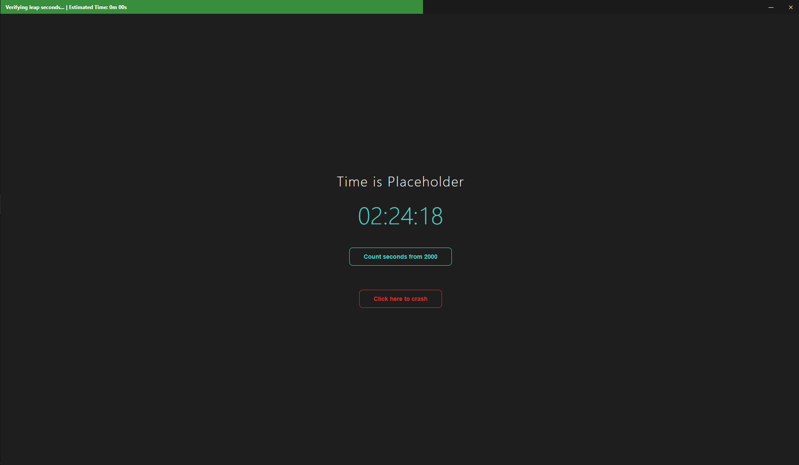
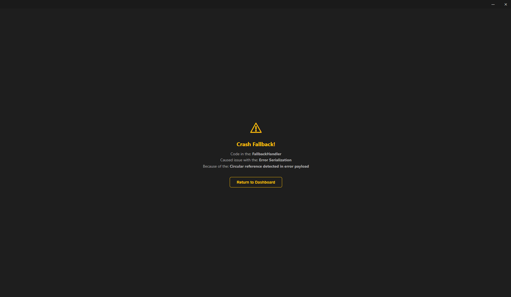

# 🛤️ Trolley

Trolley is a desktop application template that pairs Electron with a local Python backend server, providing a robust scaffold for building apps that offload heavy and libraries-bound computation to Python while keeping the UI responsive through an async job queue with real-time progress feedback.

Frameless window with custom titlebar, context isolation and safe IPC. Threaded HTTP server on localhost for executing arbitrary python scripts. Titlebar-integrated progress bar with ETA, driven by job progress files, so window header is now more than a brand identity. Windows Job Objects guarantee child process termination even on crash, no orphans, no zombies, no bullshit.

Trolley gives you an experimental, but from my perspective, fairly solid, production‑ready starting point for desktop apps that need the UI flexibility of the web and the computational power of Python. As someone using Streamlit almost each single day, this template is my wishlist for Electron made come true, the one I wish Electron could be by default.

## Screenshots





## Project Structure

```
Trolley/
├── main.js              # Electron main process
├── preload.js           # Context bridge (electronAPI)
├── renderer.js          # Renderer entry point
├── progress.js          # Titlebar progress bar widget
├── index.html           # App shell (titlebar + screen container)
├── start.bat            # Launcher script
├── package.json
│
├── router/
│   ├── defaults.json    # Default screen, fallback return target
│   └── fallbacks.json   # Error screen data bank
│
├── screens/
│   ├── screen-loader.js # Dynamic screen loader + navigator
│   ├── home/            # Default screen (clock + demo buttons)
│   │   ├── index.html
│   │   ├── style.css
│   │   └── script.js
│   └── fallback/        # Error display screen
│       ├── index.html
│       ├── style.css
│       └── script.js
│
├── server/
│   ├── server.py        # Python HTTP server + job runner
│   └── python/          # Scripts executed by /run endpoint
│       ├── time.py
│       └── seconds_since_2000.py
```

## Screen System

Each screen is a self-contained folder under `screens/` with three files:

| File | Purpose |
|---|---|
| `index.html` | Screen markup (injected into `#screen-container`) |
| `style.css` | Scoped styles (loaded once, not removed on switch) |
| `script.js` | Screen logic (removed and reloaded on each visit) |

**Navigation:**
```js
navigateTo('screen-name')        // load any screen
showFallback('title', 'detail')  // jump to fallback screen
```

The screen loader in `screen-loader.js` fetches HTML via `fetch()`, injects it into the DOM, and appends a cache-busted `<script>` tag. Previous screen scripts are cleaned up by a `data-screen` attribute selector.

Default screen loaded on startup and fallback return target are set in `router/defaults.json`:
```json
{
  "default_screen": "home",
  "fallback_return": "home"
}
```

## Python Server

The server (`server/server.py`) is a `ThreadingHTTPServer` on port 5050 that communicates with Electron over HTTP. Both processes continuously heartbeat each other — if either side fails 3 consecutive checks, the other shuts down cleanly, leaving no orphaned windows or zombie processes.

Endpoints:

| Endpoint | Method | Description |
|---|---|---|
| `/heartbeat` | GET | Health check — returns `{"status":"ok"}` |
| `/run` | POST | Submit a script for execution |
| `/status/:job_id` | GET | Poll job progress and result |

POST a script name, receive a `job_id`, then poll `/status/:id` until `done` is true. Each job runs in a temp directory that auto-deletes 30 seconds after completion. Scripts in `server/python/` receive two arguments:

```bash
python script.py --output /path/to/output.json --progress /path/to/progress.json
```

Progress reporting (optional, drives the titlebar progress bar) and result output (required) are both JSON written to the specified paths.

On Windows, the server uses Job Objects (`JOB_OBJECT_LIMIT_KILL_ON_JOB_CLOSE`) to guarantee all child processes are terminated when the server exits, regardless of how it exits.

## Progress Titlebar

Progress bar turns green on increase, red on decrease. ETA is calculated from elapsed time and displayed in the titlebar. Progress indicator is integrated via `ProgressBar` in `progress.js`:

```js
ProgressBar.show('Downloading...');       // show + reset
ProgressBar.set(45, 'Halfway there...');  // update % + message
ProgressBar.set(100);                     // full
ProgressBar.hide();                       // fade out
```

## Electron IPC

Desktop window is frameless (`frame: false`) with custom titlebar buttons. Context isolation is enabled; Node integration is disabled. Preload script exposes a minimal API via `contextBridge`:

```js
window.electronAPI
  ├── close()                  // close window
  ├── minimize()               // minimize window
  ├── maximize()               // toggle maximize
  ├── fsReaddir(relPath)       // list directory
  ├── fsReadfile(relPath, enc) // read file (utf-8 or base64)
  └── fsWritefile(relPath, c)  // write file
```

## License & Ethics

**Applicable license**

The code is released under the MIT License. You are free to use, modify, and distribute it for any purpose, including commercial ones. The reasoning is simple: large tech companies already have equivalent tools internally. Making the same capability accessible to independent researchers, startups, and individuals with unique visions levels the playing field rather than restricting it.


